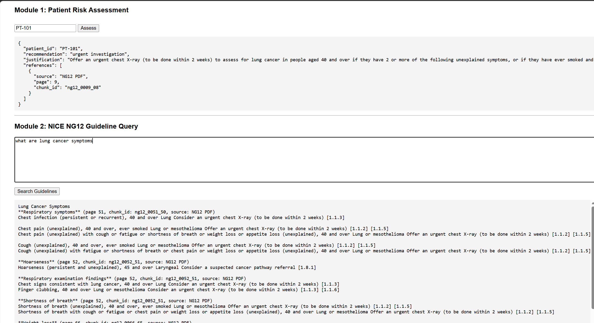

# NG12 Cancer Risk Assessor

A clinical decision support prototype that assesses cancer referral risk using **NICE NG12 guidelines** and **Gemini models**. The system ingests NICE NG12 guideline text into a local vector store and uses agent-based reasoning to return grounded, guideline-cited recommendations.

> ⚠️ **Disclaimer**: This project is for educational and research purposes only. It is **not** a medical device and must not be used for real clinical decision-making.

---

## ✨ Features

- NICE NG12 guideline ingestion and semantic search (ChromaDB)
- Multi-agent architecture (assessment + guideline lookup)
- Grounded, citation-based responses
- FastAPI backend
- Minimal HTML UI
- Local-first development (no deployment required)
- Docker-ready (optional)

---

## 📁 Project Structure

```
ng12-cancer-risk-assessor/
│
├── app/
│   ├── assess_agent.py        # Cancer risk assessment agent
│   ├── ng12_agent.py          # NICE NG12 search agent
│   ├── tools/                 # Tool functions (vector search, patient lookup)
│   ├── ui/                    # Minimal HTML UI
│   ├── PROMPTS.md             # System prompts (markdown)
│   ├── prompts.py             # Prompt loader utilities
│   ├── main.py                # FastAPI app entrypoint
│   ├── config.py              # Configuration
│   └── .env                   # Local environment variables (not committed)
│
├── ingestion/
│   ├── ingest_ng12.py         # NG12 ingestion into vector store
│   └── ingestion_test.py      # Ingestion test script
│
├── data/                      # Input data (e.g. patients.json)
├── vector_store/              # ChromaDB persistence
├── Dockerfile                 # Container build (optional)
├── requirements.txt
├── Makefile
└── README.md
```

---

## 🧠 Architecture Overview

1. **Ingestion**
   - NICE NG12 guideline text is chunked and embedded
   - Stored locally using ChromaDB

2. **Agents**
   - `assess_agent`: evaluates cancer risk using patient data + guidelines
   - `ng12_agent`: retrieves relevant NG12 guideline sections

3. **FastAPI**
   - Exposes assess and chat endpoints
   - Streams agent responses

4. **UI**
   - Minimal HTML frontend for testing Module 1 & 2

---

## ⚙️ Requirements

- Python **3.10+** (tested on 3.11/3.13)
- Virtualenv recommended
- Google GenAI API access (Gemini)

---

## 🔐 Environment Variables

Create `app/.env` (do **not** commit it):

```env
GOOGLE_GENAI_USE_VERTEXAI=true
GOOGLE_CLOUD_PROJECT=your-gcp-project-id
GOOGLE_CLOUD_LOCATION=us-central1
```

An example file is provided:

```bash
app/.envexample
```

---

## 🧪 Local Setup

### 1️⃣ Create virtual environment

```powershell
python -m venv .venv
.venv\Scripts\activate
```

### 2️⃣ Install dependencies

```powershell
pip install -r requirements.txt
```

---

## 📥 Ingest NICE NG12 Guidelines

Run once (or whenever guidelines change):

```powershell
python -m ingestion.ingest_ng12
```

Optional test:

```powershell
python -m ingestion.ingestion_test
```

---

## 🚀 Run the FastAPI Server

From project root:

```powershell
uvicorn app.main:app --reload
```

Server will start at:

```
http://127.0.0.1:8000
```

---

## 🖥️ UI

Open in browser:

```
http://127.0.0.1:8000/
```



The UI supports:
- Module 1: Patient-based assessment
- Module 2: Guideline-grounded reasoning

---

## 🔍 API Usage

### POST `/assess`

**Request**:

```json
{
  "patient_id": "PT-101"
}
```

**Response** (streamed JSON):

```json
{
  "recommendation": "urgent referral",
  "justification": "<verbatim NICE NG12 text>",
  "references": [
    {
      "source": "NG12 PDF",
      "page": 9,
      "chunk_id": "ng12_0009_08"
    }
  ]
}
```

---

## 🧾 Prompts

All system prompts live in:

```
app/PROMPTS.md
```

They are loaded dynamically using `prompts.py`, allowing:
- Multiple agents
- Multiple prompt sections
- Easy iteration without code changes

---

## 🐳 Docker (Optional)

Docker is **not required** for local development.

Run locally (create the `vector_store` before building the Docker image):

```powershell
python -m ingestion.ingest_ng12
```

Build image:

```bash
docker build -t ng12-assessor .
```

Run:

```bash
 docker run -p 8000:8000 `
  -e GOOGLE_GENAI_USE_VERTEXAI=True `
  -e GOOGLE_CLOUD_PROJECT="google-project-id" `
  -e GOOGLE_CLOUD_LOCATION=us-central1 `
  -v "$env:APPDATA\gcloud:/root/.config/gcloud" `
  ng12-assessor
```


---

## 🧪 Testing

```bash
pytest
```

---

## 📜 License

MIT License. See `LICENSE`.

---

## 🙌 Notes

- This project prioritizes **grounded outputs** over free-form generation
- Vector search is local and deterministic
- Designed to be Cloud Run–ready but local-first

---

## 🧭 Next Steps (Optional)

- Auth & audit logging
- Add more guard rails
- Enhance unit tests
- Evaluation tests
- UI improvements
- Deployment to Cloud Run

---

Happy building 🚀

